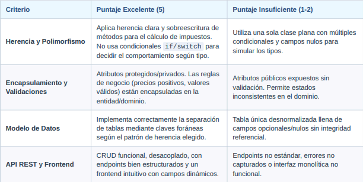

# Ejercicio Práctico: Sistema de Gestión de Vehículos
Evaluación de Programación Orientada a Objetos (POO) - Desarrollo Fullstack CRUD

+ **Objetivo del ejercicio:** Diseñar e implementar una aplicación web fullstack (Base de datos, Backend
API y Frontend) aplicando de forma explícita los pilares fundamentales de la Programación Orientada a
Objetos: Abstracción, Herencia, Encapsulamiento y Polimorfismo.

## 1. Contexto del Dominio

Una empresa de arrendamiento de transporte requiere un sistema para administrar su inventario de
vehículos. El sistema debe permitir la gestión (creación, lectura, actualización y eliminación) de dos tipos
específicos de vehículos: Autos y Motocicletas.

## 2. Requerimientos por Capa

### A. Base de Datos (Persistencia)

Diseñar un esquema relacional que soporte la herencia de entidades *(Estrategia Table-per-Type / Tabla por
Tipo)*:

- **Tabla Base  Vehiculos :** id  (PK),  marca ,  modelo ,  año ,  precio_base ,  tipo_vehiculo  ('Auto' |
'Moto').

- **Tabla  Autos :** vehiculo_id  (FK a  Vehiculos.id ),  numero_puertas ,  tipo_combustible
('Gasolina', 'Diésel', 'Eléctrico').

- **Tabla  Motocicletas :** vehiculo_id  (FK a  Vehiculos.id ),  cilindrada ,  tipo_freno  ('Disco',
'Tambor', 'ABS').

### B. Backend (Modelado POO y API REST)

El backend debe estructurarse obligatoriamente bajo principios POO:

- **Clase Base / Abstracta ( Vehiculo ):**

    * Atributos encapsulados (privados/protegidos) con sus respectivas propiedades y validaciones (ej. el precio base no puede ser ≤ 0).

    * Método abstracto o virtual  CalcularImpuestoAnual() .

- **Subclases Concretas ( Auto  y  Motocicleta ):**
    * Heredan de  Vehiculo  e incorporan los atributos específicos del tipo.
    * **Polimorfismo:** Implementar la lógica propia de  CalcularImpuestoAnual()  en cada subclase:

        * Auto: 5% del precio base + 2% adicional si el combustible es 'Gasolina' o 'Diésel'.

        * Motocicleta: 3% del precio base si la cilindrada es ≤ 150cc; 6% si es > 150cc.

- **Endpoints REST (CRUD):**

    * `GET /api/vehiculos` : Retorna la lista total de vehículos incluyendo el cálculo de impuesto dinámico.

    * `GET /api/vehiculos/{id}` : Obtiene el detalle de un vehículo específico.

    * `POST /api/vehiculos` : Crea un nuevo Auto o Motocicleta según el tipo en el payload.

    * `PUT /api/vehiculos/{id}` : Actualiza los datos de un vehículo existente.

    * `DELETE /api/vehiculos/{id}` : Elimina un vehículo.

### C. Frontend (Interfaz de Usuario)

- Definir los modelos u objetos correspondientes en el frontend.

- **Formulario Dinámico:** Al seleccionar "Tipo de Vehículo" (Auto o Moto), los campos del formulario deben
adaptarse para solicitar los atributos específicos.

- **Tabla / Dashboard:** Listado general unificado que muestre la información del vehículo y la columna
calculada del impuesto devuelta por el servidor.

## 3. Rúbrica de Calificación (Escala 1 a 5)

